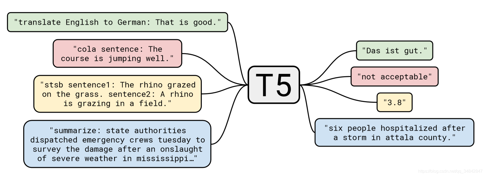
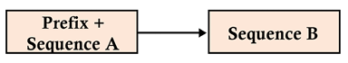

## 微博评论生成模型

> 2022人民网算法挑战赛（赛道一）

项目下载地址（模型文件过大，请移步网盘下载）：
* [百度网盘](https://pan.baidu.com/s/136TPLvbTOaikpnhmVFY-jw?pwd=6666)
* [阿里云盘](https://www.aliyundrive.com/s/3s8mbo1XDdP)

#### Demo：

<table>
	<tr>
		<td style="width: 60%"><strong>原微博</strong></td>
		<td><strong>生成的评论</strong></td>
	</tr>
	<tr>
		<td rowspan="3">【#爸爸带俩大学生女儿送儿子上浙大#】8月20日，在浙江杭州，一位爸爸带着两个女儿，送儿子上大学。爸爸说，大女儿二女儿分别在中南大学、中南民族大学就读，儿子今年考上了浙江大学。爸爸嘴上说着“还可以”，全程笑得合不拢嘴。网友：#爸爸的骄傲感屏幕都挡不住#，嘴角都快咧到耳朵根了！（韵味杭州）  新华社的微博视频</td>
		<td>希望我儿子上大学的时候能考上浙大</td>
	</tr>
	<tr>
		<td>大女儿两女儿都考上了，孩子好棒</td>
	</tr>
   <tr>
		<td>好感动!爸爸也太幸福了</td>
	</tr>
   <tr>
      <td rowspan="3">【#福厦高铁跨海大长图来了#】8月30日上午，福厦高铁全线铺轨贯通。它是国内首条跨海高铁，设计时速350公里，线路全长277.42公里，沿线设福州南、福清西、莆田、泉港、泉州东、泉州南、厦门北、漳州8座客运车站。建成通车后，将实现#福州泉州厦门一小时生活圈#、经济圈。网页链接</td>
      <td>期待早日通车!!</td>
	</tr>
   <tr>
		<td>好期待一下漳州的高铁，太棒了</td>
	</tr>
   <tr>
		<td>好想体验一下，跨海高铁在福建到台湾的通勤方式!</td>
	</tr>
   <tr>
      <td rowspan="3">【#重庆群众自发背物资徒步上山#】8月24日，重庆北碚，山上地势陡峭，车子无法到达，高温下群众自发背物资徒步上山。继“摩托车大军”之后，“徒步大军”也加入志愿者队伍。网友：#用最原始的方式守护着重庆#，谢谢你们！（重庆科教频道）  新华社的微博视频 
   </td>
      <td>军民鱼水情，众志成城，向你们致敬!!</td>
	</tr>
   <tr>
		<td>重庆人民真的太伟大了</td>
	</tr>
   <tr>
		<td>感动，重庆人民真的很棒，真的</td>
	</tr>
</table>

#### **Usage：**

1. 进入项目文件

   ```shell
   cd ./WeiboCommentRobot
   ```

2. 安装依赖

   ```shell
   pip install -r requirements.txt
   ```

3. 模型训练

   ```shell
   python train.py
   ```

4. 测试模型

   ```shell
   python predict.py
   ```

#### 基于T5模型：

​	使用transformers的**T5ForConditionalGeneration** (与T5在实现上有略微区别)：

 	T5（Transfer Text-to-Text Transformer）模型是一个统一框架，将所有 NLP 任务都转化成 Text-to-Text （文本到文本)任务。  

> 比如英德翻译，只需将训练数据集的输入部分前加上“translate English to German（给我从英语翻译成德语）” 就行。假设需要翻译"That is good"，那么先转换成 "translate English to German：That is good." 输入模型，之后就可以直接输出德语翻译 “Das ist gut.”。 对于需要输出连续值的 STS-B（文本语义相似度任务)， 也是直接输出文本。

**为输入序列增加前缀**：这种前缀不仅仅是一个标签或像`[CLS]`这种用于分类的指示器。T5前缀包含Transformer需要解决的任务的本质。通过这样的方式就能将 NLP 任务都转换成 Text-to-Text 形式，也就可以用同样的模型，同样的损失函数，同样的训练过程，同样的解码过程来完成所有 NLP 任务:



​	T5保留了原始Transformer的大多数架构。但强调了一些关键的方面。此外，还对词汇和功能做了一些细微的改变。下面列出了T5模式的一些主要概念:

- 编码器和解码器仍保留在模型中。编码器和解码器层成为块(block)，子层成为包含自注意层和前馈络的子组件(subcomponent)。像乐高一样，可以组装块和子组件来建立模型。Transformer组件是标准构件，可以用多种方式组装。
- 自注意是顺序无关的。使用矩阵的点积，而不是递归。它探索了一个序列中每个单词和其他单词之间的关系。在进行点积之前，将位置编码添加到单词的嵌入中。
- 原来的Transformer采用正弦和余弦习得位置嵌入。而T5使用相对位置嵌入。在T5中，位置编码依赖于自注意的扩展来对成对关系进行比较。
- 位置编码是共享的，同时在模型的所有层中重新评估。

**选择理由**：本次竞赛的赛道一任务是微博文本的回复生成，是典型的sequence2sequence任务，加之T5模型架构较为原生（接近原生的transformer架构），架构简单且效果不错，我们选择该模型基于其预训练模型做针对本次微博数据集的微调训练。我们定义需要训练的微博文本序列前缀为”**评论以下微博：**“，以符合T5的任务前缀定义。

#### 软件与硬件环境：

* 单张 RTX 3090 24G
* Intel i7 13700KF
* Ubuntu 22.04

#### 训练代码概述：

```
./WeiboCommentRobot
│  check_file1.py                 # 生成的submission.csv文件格式检查
│  model.py                       # 模型文件，包括数据集Dataset和训练Trainer的代码
│  predict.py                     # 模型测试文件，输出测试集的结果
│  readme.md                      # 竞赛说明文件
│  requirements.txt               # python正常运行的依赖文件
│  submission_0.5475.csv          # 测试结果submission.csv
│  train.py                       # 训练入口文件，从这里输入数据集开始训练
│  
├─dataset
│      preprocess.py              # 文本预处理，对微博文本进行清洗，去除无关符号和文字，加入任务前缀
│      process_traindata.py       # 处理训练集的文本数据，提供给trainer以便训练
│      test_A.csv                 # 测试集文件
│      train_data.csv             # 训练数据文件
│      weibo.csv                  # 预处理后生成的训练数据集文件
│
├─image                           # readme.md配图
│      seq2seq.png                
│      T5.png
│
├─model                           # 模型文件，即训练好的模型，请前往网盘下载
│      config.json
│      pytorch_model.bin
│      special_tokens_map.json
│      spiece.model
│      tokenizer_config.json
│
├─result                          # 结果文件夹，训练结束后将会在此生成模型文件和日志
│      logs.txt
│
└─summary                         # textrank算法
        algorithm_utils.py
        summary.py                # 当文本超过512长度时，首先考虑使用textrank缩短微博文本
```

#### 微博数据集：

* 传播内容认知全国重点实验室

* 数据来源：[公开数据集](http://data.sklccc.com/datashare#)

#### 数据预处理：

观察到训练数据集有以下现象：

1. ##，【】符号。一般是标题，摘要或者微博类别，博主，圈子名称。其中，标题和摘要是有用的信息，其余无关信息应予以删除。办法: 建议基于词共现，如果与全文其他文本的词共现较少，说明是无关文本，可以删除。
2. （）符号。里可能是有用信息，例如对某人某物的注释说明；也可能是记者信息，新闻出版社，机构或者时间。例如: （记者:黄浩铭）（摄影: 卢浩俊）（新华网）（中国气象局）（8月12日）（全文）（来源: 澎湃新闻），属于无关信息，应该予以判断删除。
3. @符号。符号后为微博用户（用户名，用户也包括新闻社）。例如，@都市快报，应该予以删除。@符号跟名称后都会有空格分隔。
4. ‌没有特定标识符的无关信息。例如: 新华社的微博视频，东部战区的微博视频。×××的微博视频，出现很多。出现时，字符串两边会有空格分隔。
5. ‌“网页链接”。大量出现（约有2w次出现，总共有28w样本），该词可以直接过滤掉。

在提交给trainer训练之前，需要先预处理微博文本：

* 去除上述诸多无关符号与文本；
* 当文本长度超过512时，未尽可能地避免模型输入时暴力截断文本，优先考虑TextRank算法进行缩减，留下关键句，使其长度降到512以下；
* 基于T5模型的规则，模型输入前需要定义任务前缀，我们定义了”**评论以下微博：**“作为输入文本的前缀，在每条训练文本前拼接该前缀。

#### 训练参数说明：

| 参数设置（train.py中） | 参数解释                                                                      |
| ---------------------- | :---------------------------------------------------------------------------- |
| MODEL                  | 模型路径，默认为./model                                                       |
| TRAIN_BATCH_SIZE       | 训练batch_size，默认为14（占用大约22G显存）<br>如果显存不足可以调小batch_size |
| VALID_BATCH_SIZE       | 验证batch_size，默认为14                                                      |
| TRAIN_EPOCHS           | 训练的轮数，默认为1                                                           |
| VAL_EPOCHS             | 验证的轮数，默认为1                                                           |
| LEARNING_RATE          | 学习率，默认为0.0001                                                          |
| MAX_SOURCE_TEXT_LENGTH | 最大的输入长度限制，模型中默认最大512                                         |
| MAX_TARGET_TEXT_LENGTH | 最大的输出长度限制，模型中默认最大64                                          |
| SEED                   | 随机种子，默认42                                                              |
| CUDA_DEVICE            | 训练设备，默认为cuda:0                                                        |

#### 微调代码参考：

[**CLUEbenchmark/pCLUE**](https://github.com/CLUEbenchmark/pCLUE/blob/main/Fine_tunining_PyTorch.ipynb)

#### 文件位置说明：

* 程序会首先预处理输入的数据集，预处理后放置于./result/weibo.csv
* 生成的submission.csv放置于./result/submission.csv
* 训练后的模型将保存于./result/model_files/
* **model**文件夹下为比赛所提交的预训练模型，文件共945MB

#### 若测试其他数据：

* 测试文本文件的格式与test_A.csv保持一致；

* 更改 predict.py 中 path 参数为新的测试数据文件路径：

  ```python
  if __name__ == '__main__':
      # 数据输入的文件格式与text_A.csv保持一致即可
      # 输出为./result/submission.csv
      predict(path='dataset/test_A.csv', output='submission.csv')
  ```

* 运行

  ```shell
  python predict.py
  ```

